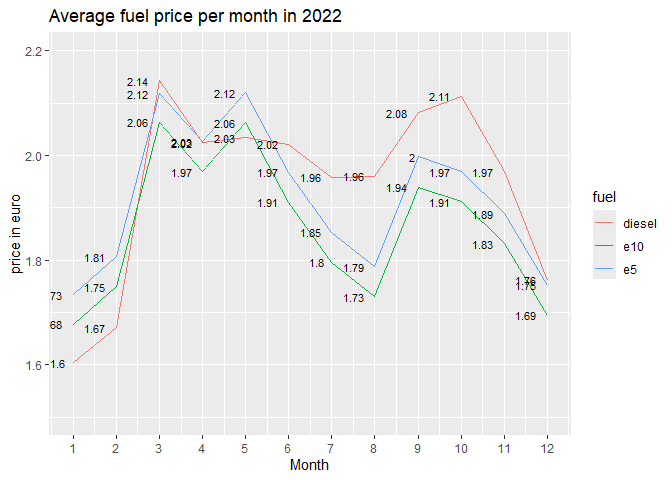
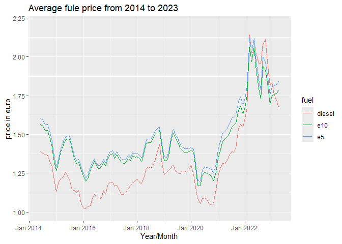
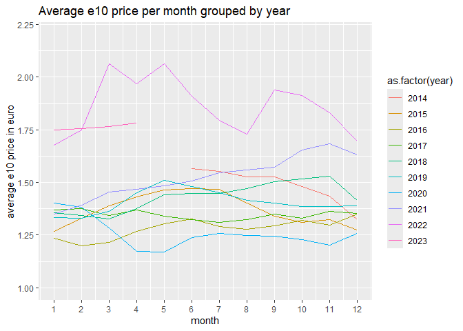
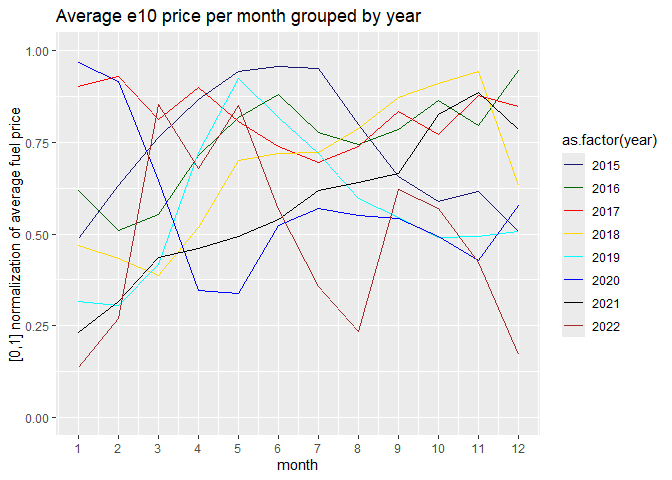
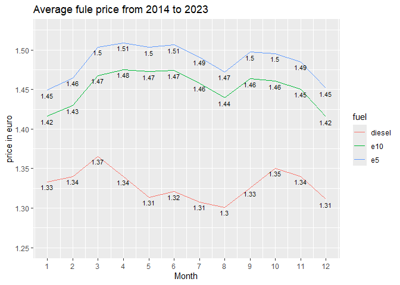
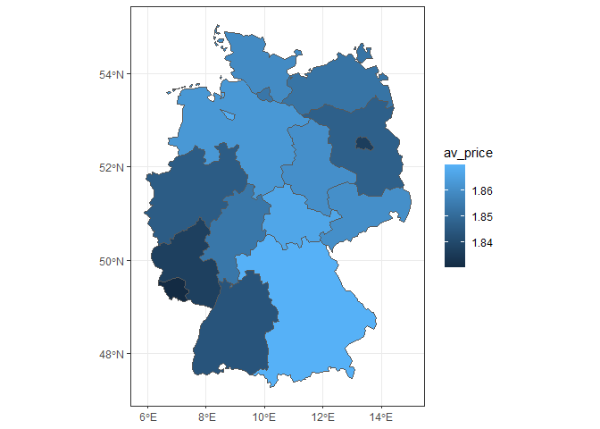
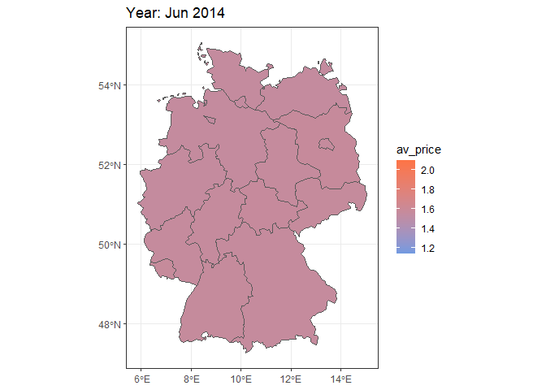

Daily German Fuel Price Analysis (2022)
================

# Overview for fuel prices for 2022

## Loading and transforming

Loading data for 2022

``` r
agg_2022 <- read.csv("Datasets/German Retail Fuel Price Data 2014-2023/aggregated_years/aggregated2022.csv")
```

Loading library `tidyverse`

``` r
library(tidyverse)
```

Transforming `fuel` columns into one column plus an additional lable
column

``` r
stacked_2022 <- agg_2022 %>%
  pivot_longer(diesel:e10, names_to = "fuel", values_to = "price")
```

## Generating an overview

Generate a short overview of fuel prices for 2022 by month

``` r
ov_month <- stacked_2022 %>%
  select(month, fuel, price) %>%
  filter(price>1) %>%
  group_by(month,fuel) %>%
  summarise(average = mean(price),
            min = min(price),
            max = max(price),
            median = median(price)
  )
```

``` r
print(ov_month)
```

    ## # A tibble: 36 × 6
    ## # Groups:   month [12]
    ##    month fuel   average   min   max median
    ##    <int> <chr>    <dbl> <dbl> <dbl>  <dbl>
    ##  1     1 diesel    1.60  1.05  1.96   1.60
    ##  2     1 e10       1.68  1.09  2.05   1.67
    ##  3     1 e5        1.73  1.12  2.11   1.73
    ##  4     2 diesel    1.67  1.07  2.04   1.66
    ##  5     2 e10       1.75  1.13  2.11   1.74
    ##  6     2 e5        1.81  1.16  2.17   1.80
    ##  7     3 diesel    2.14  1.27  2.46   2.14
    ##  8     3 e10       2.06  1.08  3.84   2.06
    ##  9     3 e5        2.12  1.12  3.61   2.12
    ## 10     4 diesel    2.02  1.38  2.45   2.02
    ## # ℹ 26 more rows

Generate a short overview of fuel prices for 2022 by station

``` r
ov_station <- stacked_2022 %>%
  select(station_uuid, fuel, price) %>%
  # try to drop false entries
  filter(price>1) %>%
  group_by(station_uuid, fuel) %>%
  # only consider if we have at least 6 month of data
  filter(n()>5) %>%
  summarise(average = mean(price),
            min = min(price),
            max = max(price),
            median = median(price)
  ) %>%
  arrange(fuel,average)
```

``` r
head(ov_station)
```

    ## # A tibble: 6 × 6
    ## # Groups:   station_uuid [6]
    ##   station_uuid                         fuel   average   min   max median
    ##   <chr>                                <chr>    <dbl> <dbl> <dbl>  <dbl>
    ## 1 02e8c37e-28fa-4755-a718-e91f345e85f5 diesel    1.35  1.08  1.56   1.35
    ## 2 32882b06-b228-47c1-b841-f92d8fb21888 diesel    1.50  1.19  1.63   1.59
    ## 3 00061777-7224-4444-8888-acdc00000001 diesel    1.56  1.09  1.92   1.62
    ## 4 577b85e6-87ec-439e-bfb4-06af5635c980 diesel    1.59  1.58  1.62   1.58
    ## 5 00061467-0012-4444-8888-acdcffffffff diesel    1.64  1.37  2.09   1.63
    ## 6 00060054-0001-4444-8888-acdc00000001 diesel    1.68  1.21  2.08   1.69

Sorted output of cheapest stations

``` r
# cheapest diesel stations:
ov_station %>%
  filter(fuel == "diesel") %>%
  head()
```

    ## # A tibble: 6 × 6
    ## # Groups:   station_uuid [6]
    ##   station_uuid                         fuel   average   min   max median
    ##   <chr>                                <chr>    <dbl> <dbl> <dbl>  <dbl>
    ## 1 02e8c37e-28fa-4755-a718-e91f345e85f5 diesel    1.35  1.08  1.56   1.35
    ## 2 32882b06-b228-47c1-b841-f92d8fb21888 diesel    1.50  1.19  1.63   1.59
    ## 3 00061777-7224-4444-8888-acdc00000001 diesel    1.56  1.09  1.92   1.62
    ## 4 577b85e6-87ec-439e-bfb4-06af5635c980 diesel    1.59  1.58  1.62   1.58
    ## 5 00061467-0012-4444-8888-acdcffffffff diesel    1.64  1.37  2.09   1.63
    ## 6 00060054-0001-4444-8888-acdc00000001 diesel    1.68  1.21  2.08   1.69

``` r
# cheapest e5 stations:
ov_station %>%
  filter(fuel == "e5") %>%
  head()
```

    ## # A tibble: 6 × 6
    ## # Groups:   station_uuid [6]
    ##   station_uuid                         fuel  average   min   max median
    ##   <chr>                                <chr>   <dbl> <dbl> <dbl>  <dbl>
    ## 1 21656c59-4297-4655-9f8b-dc8bffac6ace e5       1.30  1.15  1.45   1.30
    ## 2 02e8c37e-28fa-4755-a718-e91f345e85f5 e5       1.44  1.33  1.53   1.46
    ## 3 00061777-7224-4444-8888-acdc00000001 e5       1.55  1.20  1.88   1.56
    ## 4 dedf6ac5-4dc1-42ab-95e1-e16a109380d4 e5       1.61  1.61  1.61   1.61
    ## 5 00060054-0001-4444-8888-acdc00000001 e5       1.66  1.26  2.09   1.60
    ## 6 577b85e6-87ec-439e-bfb4-06af5635c980 e5       1.72  1.70  1.76   1.71

``` r
# cheapest e10 stations:
ov_station %>%
  filter(fuel == "e10") %>%
  head()
```

    ## # A tibble: 6 × 6
    ## # Groups:   station_uuid [6]
    ##   station_uuid                         fuel  average   min   max median
    ##   <chr>                                <chr>   <dbl> <dbl> <dbl>  <dbl>
    ## 1 17a2706b-8365-438b-0ce0-0f923a13d177 e10      1.37  1.13  1.41   1.41
    ## 2 00061777-7224-4444-8888-acdc00000001 e10      1.49  1.16  1.83   1.51
    ## 3 1cd72e2a-5f19-423c-bfc1-4c773fdc2847 e10      1.54  1.24  1.60   1.60
    ## 4 00060054-0001-4444-8888-acdc00000001 e10      1.60  1.23  2.02   1.55
    ## 5 a0ed058e-0c77-4a16-8b82-e70f80908a6b e10      1.63  1.25  1.98   1.66
    ## 6 577b85e6-87ec-439e-bfb4-06af5635c980 e10      1.66  1.65  1.7    1.65

## Plotting

Import `ggplot2` for plotting

``` r
library(ggplot2)
```

Generate a line-plot showing the average price per month

``` r
ggplot(data=ov_month, aes(x=month, y=average, group = fuel, color=fuel)) +
  geom_line(stat="identity") +
  labs(title = "Average fuel price per month in 2022",
        y = "price in euro",
        x = "Month") +
  scale_x_continuous(breaks = c(1,2,3,4,5,6,7,8,9,10,11,12)) +
  geom_text(aes(label= round(average,2)),  hjust=1.5, size=3, col = "black") +
  coord_cartesian(ylim=c(1.5,2.2))
```

<!-- -->

# General overview of fuel price from 2014 to 2023

## Loading and transforming

Since we have one file for each year, we need to merge them into one
file

``` r
# generating a list of all files
list_of_files <- list.files(path = "Datasets/German Retail Fuel Price Data 2014-2023/aggregated_years",
                            pattern = "\\.csv$",
                            full.names = TRUE)

# merging all file in the list
agg_14_to_23 <- list_of_files %>%
  map_dfr(read.csv, header=TRUE, fill=TRUE)
```

As before we are transforming `fuel` columns into one column plus an
additional lable column

``` r
stacked_14_23 <- agg_14_to_23 %>%
  pivot_longer(diesel:e10, names_to = "fuel", values_to = "price")
```

## Generating an overview

We generate an overview too

``` r
ov_year_month <- stacked_14_23 %>%
  select(year, month, fuel, price) %>%
  filter(price>1) %>%
  group_by(year,month,fuel) %>%
  summarise(average = mean(price),
            min = min(price),
            max = max(price),
            median = median(price)
  ) %>%
  arrange(year,month)
```

``` r
print(ov_year_month)
```

    ## # A tibble: 321 × 7
    ## # Groups:   year, month [107]
    ##     year month fuel   average   min   max median
    ##    <int> <int> <chr>    <dbl> <dbl> <dbl>  <dbl>
    ##  1  2014     6 diesel    1.39  1.13  1.54   1.39
    ##  2  2014     6 e10       1.57  1.01  2.00   1.56
    ##  3  2014     6 e5        1.60  1.28  2      1.60
    ##  4  2014     7 diesel    1.38  1.08  1.89   1.38
    ##  5  2014     7 e10       1.55  1.05  2.00   1.55
    ##  6  2014     7 e5        1.59  1.08  1.89   1.59
    ##  7  2014     8 diesel    1.37  1.01  2      1.37
    ##  8  2014     8 e10       1.53  1.06  2      1.53
    ##  9  2014     8 e5        1.57  1.00  2      1.57
    ## 10  2014     9 diesel    1.37  1.04  2      1.37
    ## # ℹ 311 more rows

If we want to generate a plot the show the fuel prices over time we have
to combine the `year` and `month` into `date`. Therefore, we load the
`zoo` library

``` r
library(zoo)
```

Now we combine `year` and `month` into `date`

``` r
# combine year and month to a new date column
ov_year_month$date <- zoo::as.yearmon(paste(ov_year_month$year, ov_year_month$month), "%Y %m")
```

``` r
head(ov_year_month)
```

    ## # A tibble: 6 × 8
    ## # Groups:   year, month [2]
    ##    year month fuel   average   min   max median date     
    ##   <int> <int> <chr>    <dbl> <dbl> <dbl>  <dbl> <yearmon>
    ## 1  2014     6 diesel    1.39  1.13  1.54   1.39 Jun 2014 
    ## 2  2014     6 e10       1.57  1.01  2.00   1.56 Jun 2014 
    ## 3  2014     6 e5        1.60  1.28  2      1.60 Jun 2014 
    ## 4  2014     7 diesel    1.38  1.08  1.89   1.38 Jul 2014 
    ## 5  2014     7 e10       1.55  1.05  2.00   1.55 Jul 2014 
    ## 6  2014     7 e5        1.59  1.08  1.89   1.59 Jul 2014

## Plotting

We are now able to create a line plot the provides the fuel prices from
2014 to 2023

``` r
ggplot(data=ov_year_month, aes(x=date, y=average, group = fuel, color=fuel)) +
  geom_line(stat="identity") +
  labs(title = "Average fule price from 2014 to 2023",
        y = "price in euro",
        x = "Year/Month") +
  coord_cartesian(ylim=c(1,2.2))
```

<!-- -->

Additionally, we may consider a comparison of the average price of,
e.g. **e10**, over the years:

``` r
ov_year_month %>%
        filter(fuel == "e10") %>%
        ggplot(aes(x=month, y=average, group = year, color=as.factor(year))) +
        geom_line(stat="identity") +
        labs(title = "Average e10 price per month grouped by year",
            y = "average e10 price in euro",
            x = "month") +
        scale_x_continuous(breaks = c(1,2,3,4,5,6,7,8,9,10,11,12)) +
        coord_cartesian(ylim=c(1,2.2))
```

<!-- -->

We can get a better feeling for a monthly behaviour if we normalize the
price of, **hear e10**, for each year:

``` r
temp <- ov_year_month
temp$norm_price_av <- ave(temp$average, temp$year, FUN=function(x) (x - min(x))/(max(x) - min(x)))
```

Let us plot a comparison of the normed average price of **e10** over the
years:

``` r
temp %>%
        filter(fuel == "e10") %>%
        filter(year != "2014") %>% # remove partial year
        filter(year != "2023") %>% # remove partial year
        ggplot(aes(x=month, y=norm_price_av, group = year, color=as.factor(year))) +
        scale_color_manual(values=c("midnightblue", "darkgreen", "red", "gold", "cyan", "blue", "black", "brown")) +
        geom_line(stat="identity") +
        labs(title = "Average e10 price per month grouped by year",
            y = "[0,1] normalization of average fuel price",
            x = "month") +
        scale_x_continuous(breaks = c(1,2,3,4,5,6,7,8,9,10,11,12)) +
        coord_cartesian(ylim=c(0,1))
```

<!-- -->

In general, we notice a reduce price in **January** and **December**.

In the data for **2020** we notice a huge price drop from **February**
to **April**. This marks the start of the first Corona lockdown.

In the data for **2022** we see a high increase in **February**. This is
probably due to the Russian war on Ukraine. We also notice a drop from
**June** to **August**. In that time the german government provided tax
reduction on fuel.

# Average cheapest Month

Using `stacked_14_23` to get an average price per month per fuel

## Generating an Overview

``` r
ov_14_23_month <- stacked_14_23 %>%
  select(month, fuel, price) %>%
  filter(price>1) %>%
  group_by(month,fuel) %>%
  summarise(average = mean(price),
            min = min(price),
            max = max(price),
            median = median(price)
  ) %>%
  arrange(month)
```

``` r
head(ov_14_23_month)
```

    ## # A tibble: 6 × 6
    ## # Groups:   month [2]
    ##   month fuel   average   min   max median
    ##   <int> <chr>    <dbl> <dbl> <dbl>  <dbl>
    ## 1     1 diesel    1.33  1.00     3   1.23
    ## 2     1 e10       1.42  1.00     3   1.36
    ## 3     1 e5        1.45  1.00     3   1.38
    ## 4     2 diesel    1.34  1.00     3   1.24
    ## 5     2 e10       1.43  1.00     3   1.36
    ## 6     2 e5        1.46  1.00     3   1.39

## Plotting

``` r
ggplot(data=ov_14_23_month, aes(x=month, y=average, group = fuel, color=fuel)) +
  geom_line(stat="identity") +
  labs(title = "Average fule price from 2014 to 2023",
        y = "price in euro",
        x = "Month") +
  scale_x_continuous(breaks = c(1,2,3,4,5,6,7,8,9,10,11,12)) +
  geom_text(aes(label= round(average,2)),  vjust=1.5, size=3, col = "black") +
  coord_cartesian(ylim=c(1.25,1.525))
```

<!-- -->

From 2014 to 2023 the month with the lower average price are
**January**, **August** and **December**. For **diesel** the **winter**
and **summer** month are less expansive compared to **spring** and
**fall**.

# Location Comparison

In this section we will consider fuel prices based on there location.

## Loading and Transforming

Loading data containing station information.

``` r
stations <- read.csv("Datasets/German Retail Fuel Price Data 2014-2023/stations.csv")
```

### Cleaning City Names - Writing

Let us see how many entries there are per **city**.

``` r
stations %>% count(city) %>% head(10)
```

    ##                 city n
    ## 1                    4
    ## 2           Saalfeld 1
    ## 3             AACHEN 8
    ## 4  AACHEN-RICHTERICH 1
    ## 5              AALEN 1
    ## 6             ACHERN 1
    ## 7              ACHIM 1
    ## 8          ADELSHEIM 1
    ## 9           ADENDORF 1
    ## 10           AICHACH 2

We notice that some city names - are all **capital** - have a leading
**spacec** - have a **space** at the end - are `gelöscht`, `mehr aktiv`,
`please delete - bitte loeschen` - only have one station - contain an
**odd** symbole

We have to do something about this. While we can and will ignore some,
e.g. `alsdorf h�ngen` should be the same as `alsdorf-hoengen`, we will
make some changes to others.

Making all city names **lowercase**

``` r
stations$city <- tolower(stations$city)
```

To remove a **space** at the beginning or et the end we use `trimws`

``` r
stations$city <- trimws(stations$city)
```

We will ignore the rest for now, and deal with them if they bother us
later.

Lets se how many entries there are per **city** again:

``` r
stations %>% count(city) %>% head(10)
```

    ##                    city  n
    ## 1                        4
    ## 2           aach/ hegau  1
    ## 3                aachen 35
    ## 4    aachen-oberforstb.  1
    ## 5     aachen-richterich  1
    ## 6                 aalen 14
    ## 7     aalen-fachsenfeld  1
    ## 8  aalen-wasseralfingen  1
    ## 9             aarbergen  1
    ## 10             abenberg  1

### Merging Tables

We will join the table `stations` to the table of all fuel prices from
2014 to 2023, namely `stacked_14_23` Before that, we select only the
columns we want from `stations`

``` r
stations_select <- stations %>%
  select(uuid,name,brand,post_code,city)
```

for the **joining** we use `library(dplyr)`

``` r
library(dplyr)
```

While joining, we have to account for the different `station ID` names
in the tables

``` r
full_fuel_table <- left_join(stacked_14_23, stations_select, by=c("station_uuid"= "uuid"))
```

### Cleaning City Names - NaN and Blanks

Let us have a look at the first and last few entries if we sort
`full_fuel_table` by **city**:

``` r
temp <- full_fuel_table %>%
  arrange(city)
```

First 10 entries:

``` r
print(head(temp,10))
```

    ## # A tibble: 10 × 9
    ##    station_uuid               year month fuel  price name  brand post_code city 
    ##    <chr>                     <int> <int> <chr> <dbl> <chr> <chr> <chr>     <chr>
    ##  1 5cbfcf42-67b5-495b-bcaa-…  2014     6 dies…  1.34 bft … bft   47929     ""   
    ##  2 5cbfcf42-67b5-495b-bcaa-…  2014     6 e5     1.57 bft … bft   47929     ""   
    ##  3 5cbfcf42-67b5-495b-bcaa-…  2014     6 e10    1.53 bft … bft   47929     ""   
    ##  4 5cbfcf42-67b5-495b-bcaa-…  2014     7 dies…  1.35 bft … bft   47929     ""   
    ##  5 5cbfcf42-67b5-495b-bcaa-…  2014     7 e5     1.57 bft … bft   47929     ""   
    ##  6 5cbfcf42-67b5-495b-bcaa-…  2014     7 e10    1.53 bft … bft   47929     ""   
    ##  7 5cbfcf42-67b5-495b-bcaa-…  2014     8 dies…  1.34 bft … bft   47929     ""   
    ##  8 5cbfcf42-67b5-495b-bcaa-…  2014     8 e5     1.54 bft … bft   47929     ""   
    ##  9 5cbfcf42-67b5-495b-bcaa-…  2014     8 e10    1.49 bft … bft   47929     ""   
    ## 10 5cbfcf42-67b5-495b-bcaa-…  2014     9 dies…  1.34 bft … bft   47929     ""

Last 10 entries:

``` r
print(tail(temp,10))
```

    ## # A tibble: 10 × 9
    ##    station_uuid               year month fuel  price name  brand post_code city 
    ##    <chr>                     <int> <int> <chr> <dbl> <chr> <chr> <chr>     <chr>
    ##  1 e7d91be2-a886-4e9b-ba1e-…  2023     2 e10    0    <NA>  <NA>  <NA>      <NA> 
    ##  2 fde21cdf-1c94-4525-b7e4-…  2023     1 dies…  1.86 <NA>  <NA>  <NA>      <NA> 
    ##  3 fde21cdf-1c94-4525-b7e4-…  2023     1 e5     1.83 <NA>  <NA>  <NA>      <NA> 
    ##  4 fde21cdf-1c94-4525-b7e4-…  2023     1 e10    1.77 <NA>  <NA>  <NA>      <NA> 
    ##  5 fde21cdf-1c94-4525-b7e4-…  2023     2 dies…  1.84 <NA>  <NA>  <NA>      <NA> 
    ##  6 fde21cdf-1c94-4525-b7e4-…  2023     2 e5     1.85 <NA>  <NA>  <NA>      <NA> 
    ##  7 fde21cdf-1c94-4525-b7e4-…  2023     2 e10    1.8  <NA>  <NA>  <NA>      <NA> 
    ##  8 fde21cdf-1c94-4525-b7e4-…  2023     3 dies…  1.83 <NA>  <NA>  <NA>      <NA> 
    ##  9 fde21cdf-1c94-4525-b7e4-…  2023     3 e5     1.85 <NA>  <NA>  <NA>      <NA> 
    ## 10 fde21cdf-1c94-4525-b7e4-…  2023     3 e10    1.80 <NA>  <NA>  <NA>      <NA>

We notice: - some `city names` are **blank** - - here we still have
`post_code` - some `city names` are **NaN** - - here we have no entry in
`stations` for the ID in `stacked_14_23`

Since we want to compare cities, we remove every entry that does not
have an entry in `post_code`. Removing rows with `NaN`:

``` r
full_fuel_table_cleaned <-  na.omit(full_fuel_table)
```

Let us have a look at the first and last few entries if we sort
`full_fuel_table_cleaned` by **city**:

``` r
temp <- full_fuel_table_cleaned %>%
  arrange(city)
```

First 10 entries:

``` r
print(head(temp,10))
```

    ## # A tibble: 10 × 9
    ##    station_uuid               year month fuel  price name  brand post_code city 
    ##    <chr>                     <int> <int> <chr> <dbl> <chr> <chr> <chr>     <chr>
    ##  1 5cbfcf42-67b5-495b-bcaa-…  2014     6 dies…  1.34 bft … bft   47929     ""   
    ##  2 5cbfcf42-67b5-495b-bcaa-…  2014     6 e5     1.57 bft … bft   47929     ""   
    ##  3 5cbfcf42-67b5-495b-bcaa-…  2014     6 e10    1.53 bft … bft   47929     ""   
    ##  4 5cbfcf42-67b5-495b-bcaa-…  2014     7 dies…  1.35 bft … bft   47929     ""   
    ##  5 5cbfcf42-67b5-495b-bcaa-…  2014     7 e5     1.57 bft … bft   47929     ""   
    ##  6 5cbfcf42-67b5-495b-bcaa-…  2014     7 e10    1.53 bft … bft   47929     ""   
    ##  7 5cbfcf42-67b5-495b-bcaa-…  2014     8 dies…  1.34 bft … bft   47929     ""   
    ##  8 5cbfcf42-67b5-495b-bcaa-…  2014     8 e5     1.54 bft … bft   47929     ""   
    ##  9 5cbfcf42-67b5-495b-bcaa-…  2014     8 e10    1.49 bft … bft   47929     ""   
    ## 10 5cbfcf42-67b5-495b-bcaa-…  2014     9 dies…  1.34 bft … bft   47929     ""

Last 10 entries:

``` r
print(tail(temp,10))
```

    ## # A tibble: 10 × 9
    ##    station_uuid               year month fuel  price name  brand post_code city 
    ##    <chr>                     <int> <int> <chr> <dbl> <chr> <chr> <chr>     <chr>
    ##  1 36329346-55f7-4749-ab8f-…  2023     1 e10    1.7  Budg… Budg… 54539     ürzig
    ##  2 36329346-55f7-4749-ab8f-…  2023     2 dies…  1.83 Budg… Budg… 54539     ürzig
    ##  3 36329346-55f7-4749-ab8f-…  2023     2 e5     1.80 Budg… Budg… 54539     ürzig
    ##  4 36329346-55f7-4749-ab8f-…  2023     2 e10    1.74 Budg… Budg… 54539     ürzig
    ##  5 36329346-55f7-4749-ab8f-…  2023     3 dies…  1.63 Budg… Budg… 54539     ürzig
    ##  6 36329346-55f7-4749-ab8f-…  2023     3 e5     1.75 Budg… Budg… 54539     ürzig
    ##  7 36329346-55f7-4749-ab8f-…  2023     3 e10    1.69 Budg… Budg… 54539     ürzig
    ##  8 36329346-55f7-4749-ab8f-…  2023     4 dies…  1.59 Budg… Budg… 54539     ürzig
    ##  9 36329346-55f7-4749-ab8f-…  2023     4 e5     1.79 Budg… Budg… 54539     ürzig
    ## 10 36329346-55f7-4749-ab8f-…  2023     4 e10    1.73 Budg… Budg… 54539     ürzig

We still have **blank** city names, but for this case we can consider
the post code.

### Cleaning City Names - Post Code

Create an overview of all stations that have a blank city entry:

``` r
temp <- stations %>%
  select(uuid,city,post_code) %>%
  filter(city=="")
print(temp)
```

    ##                                   uuid city post_code
    ## 1 5cbfcf42-67b5-495b-bcaa-e4871ceb3988          47929
    ## 2 5d7f3329-7a3f-4dcb-ab3d-4d6d757ae1c0          97688
    ## 3 4e8ecfc5-5d0d-4463-901b-6b9ff8fee510               
    ## 4 27b7b18e-85a8-455d-863c-2f8dbdcf256d          44357

We get - `47929`, which is the post code of **grefrath** - `97688`,
which is the post code of **bad kissingen** - `44357`, which is the post
code of **dortmund** - , wich we will remove

> It would be best to change this in `stations` at the beginning but
> this document is ment to show the process. Therefore, I wil will try
> to add this information now without just reapplying the above.

Adding missing information in `stations` first:

``` r
stations$city[stations$post_code == 47929] <- "grefrath"
stations$city[stations$post_code == 97688] <- "bad kissingen"
stations$city[stations$post_code == 44357] <- "dortmund"
```

Adding missing information in `full_fuel_table_cleaned`:

``` r
full_fuel_table_cleaned$city[full_fuel_table_cleaned$post_code == 47929] <- "grefrath"
full_fuel_table_cleaned$city[full_fuel_table_cleaned$post_code == 97688] <- "bad kissingen"
full_fuel_table_cleaned$city[full_fuel_table_cleaned$post_code == 44357] <- "dortmund"
```

Now all that is left for now is removing **blank** entries in
`postal_code` as well as **00000** entries.

``` r
full_fuel_table_cleaned <- full_fuel_table_cleaned %>%
        filter(post_code != "") %>%
        filter(post_code != "00000")
```

We also get rid of odd prices:

``` r
full_fuel_table_cleaned <- full_fuel_table_cleaned %>%
      filter(price>0.7) %>%                                 # would be better to use statistical analysis here
      filter(price<5)                                       # would be better to use statistical analysis here
```

## Generate an Overview of Fuel Price by location

~~Since a **city** can have a multiple **post codes** but a **post
code** is tied to exactly one **city**, we will group by `post_code` and
later match them with the corresponding city.~~

**A post code can have multiple place names and vice versa. This makes
it quite hard to identify.**

See for example the post code **22113**. It references to a place in
**Hamburg** as well as to **Oststeinbek**. The later one is not even
part of the same region/state (Bundesland).

> This seems odd, since we added the city information above, but
> remember that this is ment as a learning experience. The goal is not
> getting a result fast, it is to overcome problems occurring on the
> way. So yes, we could have skipped the `city` cleaning part and just
> went with the `post_code` from the beginning.

To identify the post code and provide a city name, we use data set
obtained
\[here\]\[<https://www.datenbörse.net/item/Postleitzahlen-Datenbank_Deutschland>\].
We had to replace the seperator `;` with `,`.

Loding the data:

``` r
plz <- read.csv("Datasets/Postleitzahlen 2023 mit Bundesland.csv")
# column names: PLZ,ORT,ZUSATZ,BUNDESLAND 
# (post code, name of place (city name), additional information, region/state)
```

A joining attempted:

> `full_fuel_table_cleaned_plz <- left_join(full_fuel_table_cleaned, plz, by=c("post_code"= "PLZ"))`

resulted in a warning:

> Warning in left_join(full_fuel_table_cleaned, plz, by = c(post_code =
> “PLZ”)) :
>
> Detected an unexpected many-to-many relationship between `x` and `y`.
>
> i Row 16480 of `x` matches multiple rows in `y`. \> i Row 6973 of `y`
> matches multiple rows in `x`.
>
> i If a many-to-many relationship is expected, set
> `relationship = >   "many-to-many"` to silence this warning.

Considering the file, on notice that if several places have the same
post code, they are **not** combined in one place. Therefore, postal
codes can occur multiple times. In order to fix that one could remove
duplicates ,e.g. arbitrarily. We will not do so, but proceed by only
focusing on the post code for now.

Create an overview of average fuel prices grouped by `post_code`:

``` r
temp <- full_fuel_table_cleaned %>%
        select(year, month, fuel, price, brand, post_code) %>%
        group_by(post_code) %>%
        summarise(average = mean(price),
                  min = min(price),
                  max = max(price),
                  median = median(price),
                  size = n()              # group size, how many data entries were combined
  ) %>%
  arrange(average)

print(head(temp))
```

    ## # A tibble: 6 × 6
    ##   post_code average   min   max median  size
    ##   <chr>       <dbl> <dbl> <dbl>  <dbl> <int>
    ## 1 89617        1.14 0.966  2      1.09    24
    ## 2 Nicht        1.20 0.949  1.56   1.17    55
    ## 3 40217        1.21 1.00   1.57   1.16    26
    ## 4 44577        1.22 0.821  1.59   1.20    79
    ## 5 95478        1.22 0.703  2.09   1.21   299
    ## 6 12345        1.23 0.708  1.52   1.24    16

Short detour: We should think about `size`, since it is important to
know how many entire were combined in order to evaluate if the quality
of the outcome.

We have **10 years** wherein **2** are incomplete. For **2014** we have
**7** month of data and for **2023** we have **4** month of data.
Keeping that in mind, we end up with `8*12 + 7 + 4 = 107` different
month.

Furthermore, we distinguish between **3** different fuels:
`diesel, e5, e10`.

Combining this, a station that provides all three fuels over the full
length of 107 month, should provide us with **321** data entries.

Let us count the entries we have per `station_uuid`:

``` r
temp <- full_fuel_table_cleaned %>%
      group_by(station_uuid) %>%
      summarise(occurrence_of_uuid = n() ) %>%             # group size, how many data entries were combined
      arrange(occurrence_of_uuid)
```

Let us look at the first few entries

``` r
print(head(temp,5))
```

    ## # A tibble: 5 × 2
    ##   station_uuid                         occurrence_of_uuid
    ##   <chr>                                             <int>
    ## 1 171ab6f7-929d-4a98-a2f6-b728b3d27d83                  1
    ## 2 33f50d5a-d5b0-46c5-9e45-ee47d1969a69                  2
    ## 3 41b7dda5-a14c-11e9-aa1f-005056a2a083                  2
    ## 4 ffa490bb-999c-403e-b2a2-d8f6a0c88316                  2
    ## 5 00060075-1a13-c428-0006-0075ffffffff                  3

Let us look at the last few entries

``` r
print(tail(temp,5))
```

    ## # A tibble: 5 × 2
    ##   station_uuid                         occurrence_of_uuid
    ##   <chr>                                             <int>
    ## 1 40edf151-dc4a-41e6-872b-3c5b292e01b9                336
    ## 2 747aee23-1087-45c8-8270-6cd4e80b3e59                336
    ## 3 7c7ca68c-321e-4918-a4c9-cd4b8190c53f                336
    ## 4 22657dcc-b9e5-4122-8bc8-7daa12222893                339
    ## 5 c5f56fa3-a811-46f7-a6a2-e2e83f2ee576                339

We notice that some stations do not provide us with enough information
to use.

> We should think about how much information is enough. Reasons for
> missing data could be:
>
> - closer over a time frame
>
> - existence of the station is
>
> - reduced collection of fuels
>
> There might be more reasons. Since 321 entries were perfect I think it
> would be fine if we go wth 50% of this as a threshold. One could
> provide more checks here, e.g. if the missing data is connected or
> grouped in some way (fuel, period of time), but I will not do that.

> In addition, we see that some station have more entries than they
> should have. Going back through all iterations I found the reason: It
> can happen that e.g. in aggregated2016.csv there is information about
> the 12th month of a station in aggregated2015.csv, but that
> information is also provided in aggregated2015.csv. Therefore, we
> sometimes get doubles of december entries. Since we usually consider
> the average of some group, it makes no difference for us at the
> moment. Therefore, I will not do anything about that right now, but if
> one wanted to something about this, one could just take the average.

In order to use the information we joint `temp` to
`full_fuel_table_cleaned` by `uuid`:

``` r
full_fuel_table_cleaned <- left_join(full_fuel_table_cleaned, temp, by="station_uuid")
```

Now we can get valuable results regarding fuel prices by post code.

``` r
fuel_price_postcode <- full_fuel_table_cleaned %>%
        filter(occurrence_of_uuid>160) %>%    # roughly 50% all possible data per uuid
        group_by(post_code,year, month,fuel) %>%
        summarise(av_price = mean(price),
                  group_size = n())
```

Next we generate an overview for each year and each fuel:

``` r
f <- "e10"  # Set FUEL
y <- 2022   # Set Year

temp <- fuel_price_postcode %>%
        filter(year == y) %>%
        filter(fuel == f) %>%
        arrange(av_price)
```

``` r
print(head(temp,15))
```

    ## # A tibble: 15 × 6
    ## # Groups:   post_code, year, month [15]
    ##    post_code  year month fuel  av_price group_size
    ##    <chr>     <int> <int> <chr>    <dbl>      <int>
    ##  1 85416      2022     1 e10      0.766          1
    ##  2 25709      2022     8 e10      0.847          1
    ##  3 36169      2022     1 e10      0.895          1
    ##  4 18375      2022     6 e10      1.03           1
    ##  5 79798      2022     8 e10      1.13           1
    ##  6 18465      2022     6 e10      1.19           1
    ##  7 25923      2022     3 e10      1.22           1
    ##  8 95478      2022    10 e10      1.23           1
    ##  9 70734      2022     2 e10      1.24           2
    ## 10 84378      2022     6 e10      1.24           1
    ## 11 95478      2022     1 e10      1.26           1
    ## 12 53557      2022     4 e10      1.26           1
    ## 13 85652      2022     8 e10      1.30           1
    ## 14 34359      2022     1 e10      1.31           1
    ## 15 58452      2022     9 e10      1.33           2

## Map Plot

Next we identify the `post_code` with the corresponding
state/region/Bundesland. We shall remember that this is not possible,
since it happens that a post code occurs in two different sates, see,
e.g. **22113**. Regardless we will do so. In cases as above we will
count the post code for both states.

We start by joining `full_fuel_table_cleaned` with `plz`:

``` r
fuel_price_state <- left_join(full_fuel_table_cleaned,plz,by = c("post_code" = "PLZ"))
```

We are presented with the following waring:

> Warning in left_join(full_fuel_table_cleaned, plz, by = c(post_code =
> “PLZ”)) : Detected an unexpected many-to-many relationship between `x`
> and `y`. i Row 40 of `x` matches multiple rows in `y`. i Row 12091 of
> `y` matches multiple rows in `x`. i If a many-to-many relationship is
> expected, set `relationship =   "many-to-many"` to silence this
> warning.

We assumed that something like that might happen, since of the example
**22113**. The problem here its, that this happens not because of a
**state** but because of a **place**. In order to avoid that we will
group `plz` by `BUNDESLAND` and `PLZ`.

``` r
plz_state <- plz %>%
        group_by(BUNDESLAND,PLZ) %>%
        summarise(group_size = n())
```

    ## `summarise()` has grouped output by 'BUNDESLAND'. You can override using the
    ## `.groups` argument.

``` r
print(head(plz_state),10)
```

    ## # A
    ## #   tibble:
    ## #   6 × 3
    ## # Groups:  
    ## #   BUNDESLAND
    ## #   [1]
    ## # ℹ 3
    ## #   more
    ## #   variables:
    ## #   BUNDESLAND <chr>,
    ## #   PLZ <chr>,
    ## #   group_size <int>

Having a look at the outcome we notice - some entries of `PLZ` are not
numerical - some entries of `BUNDESLAND` are blank, not a state or
misspelled

Cleaning of `plz`:

``` r
plz_clean <- plz %>%
        filter(BUNDESLAND != "")

plz_clean$BUNDESLAND <- trimws(plz_clean$BUNDESLAND)
plz_clean$BUNDESLAND[plz_clean$BUNDESLAND == "Anhalt"] <- "Sachsen-Anhalt"
plz_clean$BUNDESLAND[plz_clean$BUNDESLAND == "Baden"] <- "Baden-Württemberg"
plz_clean$BUNDESLAND[plz_clean$BUNDESLAND == "Bay"] <- "Bayern"
plz_clean$BUNDESLAND[plz_clean$BUNDESLAND == "Holst"] <- "Schleswig-Holstein"
plz_clean$BUNDESLAND[plz_clean$BUNDESLAND == "Holstein"] <- "Schleswig-Holstein"
plz_clean$BUNDESLAND[plz_clean$BUNDESLAND == "Mecklenburg"] <- "Mecklenburg-Vorpommern"


states_list <-  c("Baden-Wuerttemberg","Bayern","Berlin","Brandenburg","Bremen","Hamburg","Hessen","Mecklenburg-Vorpommern","Niedersachsen","Nordrhein-Westfalen","Rheinland-Pfalz","Saarland","Sachsen","Sachsen-Anhalt","Schleswig-Holstein","Thueringen")


plz_state <- plz_clean %>%
        filter(BUNDESLAND %in% states_list) %>%
        group_by(BUNDESLAND, PLZ) %>%
        summarise(group_size = n())
```

We now join again and group by `BUNDESLAND`, `year`, `month` and `fuel`

``` r
temp <- left_join(full_fuel_table_cleaned,plz_state,by = c("post_code" = "PLZ"))
fuel_price_state <- temp%>%
        group_by(BUNDESLAND, year, month, fuel) %>%
        filter(BUNDESLAND %in% states_list) %>%
        summarise(av_price = median(price),
                  gr_size = n())
```

We now have a well-prepared data set, that can be used to get a overview
of different fuel prices per state per year per month.

Loading some libraries:

``` r
library(sf)
library(tidyverse)
theme_set(theme_bw())
library(giscoR)
```

To provide a geographical context we want to add the administrative
boundaries of Germany on a federal-state scale.

``` r
germany <- gisco_get_nuts(
  nuts_level = 1,
  resolution = 10,
  country = "Germany",
  year = 2021
)

# small changes due to our own data
germany$NUTS_NAME[germany$NUTS_NAME == "Thüringen"] <- "Thueringen"
germany$NUTS_NAME[germany$NUTS_NAME == "Baden-Württemberg"] <- "Baden-Wuerttemberg"
```

For the year **2022** and **e10** we then get

``` r
temp <- fuel_price_state %>%
        filter(year == 2022) %>%
        filter(fuel == "e10") %>%
        select(BUNDESLAND, av_price) %>%
        group_by(BUNDESLAND) %>%
        summarise(av_price=mean((av_price)))
```

    ## Adding missing grouping variables: `year`, `month`

``` r
ger_end <- germany %>%
  left_join(temp, by = c("NUTS_NAME" = "BUNDESLAND"))

# plot(ger_end["av_price"])

# using ggplot2
ggplot(ger_end) +
  geom_sf(aes(fill = av_price))
```

<!-- -->

We will now try to get an animated version. For this we use:

``` r
library(gganimate)
```

We combine `month` and `year` to a `date` column:

``` r
# combine year and month to a new date column
fuel_price_state$date <- zoo::as.yearmon(paste(fuel_price_state$year, fuel_price_state$month), "%Y %m")
```

Considering `e10:`

``` r
temp <- fuel_price_state %>%
        filter(fuel == "e10") %>%
        select(BUNDESLAND, date,av_price) %>%
        group_by(BUNDESLAND, date) %>%
        summarise(av_price=mean((av_price)))
```

    ## Adding missing grouping variables: `year`, `month`
    ## `summarise()` has grouped output by 'BUNDESLAND'. You can override using the
    ## `.groups` argument.

``` r
ger_end <- germany %>%
  left_join(temp, by = c("NUTS_NAME" = "BUNDESLAND"))
```

Plotting:

``` r
p <- ggplot(ger_end) +
  geom_sf(aes(fill = av_price)) +
  labs( title = 'Year: {closest_state}') +
  scale_fill_gradient(low = '#709AE1', high = '#FD7446')+
  transition_states(date)
animate(p, fps=3)
```

<!-- -->
