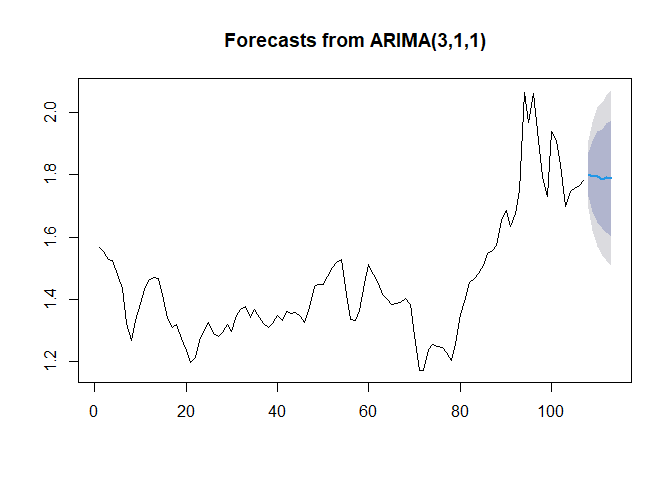

# Data Analysis: Fuel Prices

This project is a learning project.
It is used, so I can practice ``R``, ``Python`` and ``Power Bi`` for analysis and visualisation.

## Description

Using a dataset found [here](https://www.kaggle.com/datasets/oles04/petrol-station-germany), I will use data analysis tools to investigate.

> This will be quite simple, since it is mainly used to get a feeling for ``R`` as well as ``R Markdown``.

## Overview of Fuel Prices in Germany

### Full Analysis
A full overview can be found here [Analysis_Fuel_Price.md](Analysis_Fuel_Price.md).

### Partial Results -- Average Fuel Price per Month in 2022
<!-- -->

### Partial Results -- Average Price of e10 per Month Grouped by Year
<!-- -->

### Partial Results -- Average Fuel Price per Month from 2014-2023
<!-- -->

### Partial Results -- Map of Germany with Average e10 Prices per Federal State in 2022
<!-- -->

### Partial Results -- Animated Map of Germany with Average e10 Prices per Federal State over Time
<!-- -->

### ARIMA Forcasting for next 6 Month for e10
<!-- -->
